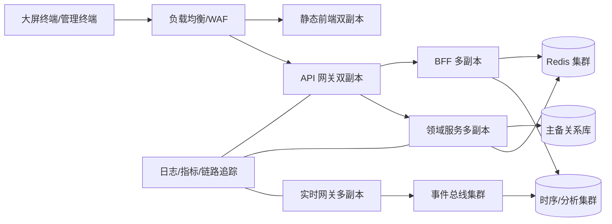

# 无人机低空智慧调度平台

## 生产级实现设计方案

| 项目 | 内容 |
|---|---|
| 文档版本 | V1.0 |
| 编制日期 | 2026-08-12 |
| 设计依据 | `FDE实操需求文档-无人机低空智慧调度平台.md`、接口字段说明、JSON/CSV Mock 数据 |
| 设计原则 | 先实现可运营、可审计、可扩展的态势大屏，再逐步接入实时飞行与 AI 能力 |
| 图片处理 | **未参考** `无人机大屏参考截图.png`；本方案仅依据文字与接口材料 |

> **方案结论**  
> 当前材料定义了大屏展示的核心功能，但未定义生产所需的实时遥测、设备位置、登录鉴权、验证码、天气、地图服务、权限与告警闭环接口。生产建设必须采用“运营支撑服务 + 实时数据平台 + 可视化应用”三层架构；现有五个 Mock 接口仅可作为统计读模型的原型输入，不可直接作为生产 API 契约。

---

## 1. 目标、边界与设计原则

### 1.1 已确认业务目标

- 面向公安、交管等业务部门，提供无人机常态化巡航的“态势一张图”。
- 支持单架或多架无人机统一调度后的飞行数据、任务状态、飞行案例和统计数据展示。
- 大屏展示飞行总览、最新飞行案例、任务排行榜、飞行统计分析和中心地图。
- 支持卫星图、电子地图、暗色主题底图切换。
- 支持 16:9、21:9、32:9、48:9 大屏，覆盖 `1920×1080` 至 `7680×1440`。
- 登录后进入大屏；登出后返回登录页。

### 1.2 本期产品边界

本期生产设计将大屏定位为**态势感知与辅助决策应用**，不将“AI识别”“自动调度”“自动处置”视为已具备的交付能力。

| 本期应交付 | 本期不应默认交付 |
|---|---|
| 实时态势展示、统计分析、任务状态、地图图层、权限控制、审计、告警展示 | 无人机自动飞控、自动强制返航、自动跨部门派单、自动执行处置动作 |
| 已接入数据源的告警/识别结果展示及人工确认入口 | 未定义数据集与验收口径的图像识别模型训练及“95%准确率”承诺 |
| 任务、飞行、组织等数据的聚合统计 | 直接对生产库执行自然语言 SQL、跨部门无限制数据检索 |

### 1.3 设计原则

1. **安全优先。**飞控链路与展示链路隔离；大屏仅有只读或明确授权的受控操作。
2. **数据可追溯。**所有指标可回溯至源数据、计算规则、统计时段和刷新时间。
3. **实时与统计分离。**实时位置走流式链路，历史统计走聚合读模型，避免大屏查询压垮业务库。
4. **最小权限。**组织、数据级别和用户角色共同决定可见范围，前端不得承担授权判断。
5. **渐进交付。**先数据接入和态势展示，后多机协同、告警闭环、AI能力。
6. **接口先行。**先冻结 OpenAPI、事件模型、数据字典和验收口径，再开始联调开发。

---

## 2. 需求解读与关键缺口

### 2.1 功能需求映射

| 模块 | 已确认需求 | 生产实现模块 | 关键依赖 |
|---|---|---|---|
| 登录 | 用户名、密码、验证码；登录/登出跳转 | 统一身份认证、验证码、会话管理、权限初始化 | 身份源、用户/组织/角色数据 |
| 顶部导航 | 标题、时间、日期、星期、天气、用户信息、首页 | 时间服务、天气代理、用户菜单、全屏控制 | 天气数据、用户会话 |
| 飞行总览 | 方舱、飞手、航线、成果、工单、架次、计划、里程、时长 | 指标聚合服务、指标字典、缓存读模型 | 任务、飞行、组织主数据 |
| 飞行案例 TOP10 | 按执行时间倒序，展示编号、航线、记录、执行时间、设备 | 飞行记录查询服务、排序及分页、脱敏字段 | 飞行记录、航线、设备/方舱数据 |
| 任务排行榜 | 按时间范围、状态、组织展示数量和占比 | 任务统计服务、组织树授权过滤、榜单读模型 | 任务状态机、组织树、时间口径 |
| 飞行统计 | 按组织统计架次、里程、时长 | 飞行指标服务、日粒度汇总、趋势/排行组件 | 飞行轨迹/记录、里程计算规则 |
| 中央地图 | 三种底图，默认设备所在地；无设备默认上海 | GIS 地图服务、设备位置流、图层控制、视野策略 | 地图服务、设备主数据、遥测流 |

### 2.2 当前材料无法支撑生产实现的缺口

| 编号 | 缺口 | 影响 | 生产级处置建议 |
|---:|---|---|---|
| G-01 | 未定义无人机设备、经纬度、航向、高度、速度、电量等实时遥测接口 | 中央地图无法展示设备位置，默认中心规则也无法实现 | 增加设备主数据 API、遥测 WebSocket/MQTT 事件及历史轨迹查询 API |
| G-02 | 未定义登录、验证码、登出、令牌刷新和权限接口 | 无法安全完成登录模块 | 接入 OIDC/OAuth 2.1 或既有统一身份平台；验证码仅用于登录防护 |
| G-03 | 未定义天气数据来源、服务等级和故障降级 | 顶栏天气不能稳定展示 | 后端统一代理天气服务，配置缓存和“数据暂不可用”降级 |
| G-04 | 未定义地图供应商、坐标系、授权范围、离线策略 | 底图切换与地图合规不可落地 | 确认地图服务、GCJ-02/WGS-84 转换责任、瓦片授权和专网部署方式 |
| G-05 | 未定义任务状态机及状态变更规则 | “待派发/派发中/已接单/已结单”统计口径可能失真 | 形成状态机、状态变更事件和时间口径字典 |
| G-06 | 未定义组织树、数据分级与跨部门访问规则 | 排行榜和大屏会产生越权展示风险 | 建立组织、角色、数据域、区域范围四层授权模型 |
| G-07 | Mock 数据中存在静态授权头示例 | 不能作为生产鉴权方式，存在泄露和伪造风险 | 删除硬编码令牌，使用短期访问令牌、刷新令牌和服务间身份认证 |
| G-08 | 飞行案例 Mock 的记录不是倒序；JSON 与 CSV 的组织名称不一致 | 验收结果不一致 | 生产以数据库 `executed_at DESC, id DESC` 排序；建立单一数据源与接口契约测试 |
| G-09 | 接口文档称“AI识别结果”，需求称“飞行案例 TOP10” | 展示对象不明确 | 分拆飞行记录和识别事件两个资源；本期页面明确使用 `flight-records` |
| G-10 | 请求体携带 `loginUserId`、`loginDeptId` | 客户端可伪造用户和部门范围 | 后端从访问令牌解析身份；请求仅允许业务筛选条件 |

### 2.3 待业务方确认的决策项

| 决策项 | 必须确认的内容 | 决策时点 |
|---|---|---|
| 监控对象 | 是仅展示无人机，还是同时展示方舱、飞手、任务、告警和视频点位 | 详细设计前 |
| 实时等级 | 位置刷新目标、允许延迟、断链告警时长、在线判定规则 | 遥测接入前 |
| 组织与权限 | 市级/区县/部门/方舱的可见范围，敏感航线与警务数据的脱敏规则 | 权限设计前 |
| 地图能力 | 供应商、坐标系、卫星图授权、是否需离线地图和内网地图服务 | GIS 设计前 |
| 数据保留 | 遥测、轨迹、任务、告警和审计日志的保留期限及归档策略 | 数据设计前 |
| 操作边界 | 大屏是否只读；告警是否允许确认、标记、转派；谁对处置结果负责 | 流程设计前 |
| 高可用等级 | 是否 7×24 运行，RTO/RPO、容灾机房和专网隔离要求 | 基础设施设计前 |

---

## 3. 总体架构

### 3.1 架构分层

```mermaid
flowchart TB
  subgraph source[数据与设备源]
    UAV[无人机/机库/方舱]
    OPS[既有任务与工单系统]
    GIS[地图与空域服务]
    EXT[天气/组织/统一身份平台]
  end

  subgraph ingress[接入与安全区]
    IOT[IoT 接入网关\nMQTT/HTTPS]
    API[API 网关\nOIDC/WAF/限流]
    ETL[批量与 CDC 接入]
  end

  subgraph platform[低空数据与业务平台]
    BUS[事件总线\nKafka/Pulsar]
    RULE[实时规则与状态计算]
    BIZ[任务/设备/飞行/告警服务]
    AGG[指标聚合服务]
    AUTH[权限与审计服务]
  end

  subgraph data[数据层]
    OLTP[(关系数据库)]
    TS[(时序/轨迹库)]
    OLAP[(分析型数据库)]
    CACHE[(Redis)]
    OBJ[(对象存储)]
  end

  subgraph apps[应用层]
    BFF[BFF / 大屏 API]
    WS[实时推送网关\nWebSocket/SSE]
    WEB[Vue 大屏]
    ADMIN[运营管理后台]
  end

  UAV --> IOT
  OPS --> ETL
  GIS --> API
  EXT --> API
  IOT --> BUS
  ETL --> BUS
  API --> BIZ
  BUS --> RULE --> BIZ
  BUS --> AGG
  BIZ --> OLTP
  RULE --> TS
  AGG --> OLAP
  BIZ --> CACHE
  BIZ --> OBJ
  AUTH --> OLTP
  BIZ --> BFF
  AGG --> BFF
  CACHE --> BFF
  BFF --> WEB
  WS --> WEB
  BUS --> WS
  AUTH --> API
  ADMIN --> API
```



### 3.2 服务边界

| 服务 | 核心职责 | 写模型 | 读模型/对外能力 |
|---|---|---|---|
| 身份与权限服务 | SSO 对接、用户/角色/组织/数据权限、审计 | 用户、角色、授权策略 | 当前用户、数据域、组织树 |
| 设备与方舱服务 | 无人机、方舱、机型、设备状态主数据 | 设备、方舱、能力、位置基准 | 设备目录、设备详情、在线状态 |
| 任务服务 | 任务创建、状态变更、调度记录、责任归属 | 任务、状态流转、执行关系 | 任务列表、状态汇总、组织排行 |
| 飞行服务 | 飞行计划、飞行记录、航线、轨迹索引 | 飞行记录、航线、里程结果 | 最新案例、历史记录、轨迹回放 |
| 遥测接入与规则服务 | 消费设备消息，校验、去重、状态计算、异常规则 | 遥测事件、在线状态、规则命中 | 实时位置、在线/离线、告警流 |
| 告警服务 | 告警归并、等级、确认、转派、闭环和通知 | 告警、处理记录、通知记录 | 告警列表、实时告警、闭环统计 |
| 指标聚合服务 | 日/时/组织/状态维度汇总，生成大屏读模型 | 聚合快照、计算版本 | 总览、排行榜、趋势、同比环比 |
| 地图服务 | 图层元数据、区域、围栏、坐标转换、GIS 查询 | 图层、区域、围栏 | 地图配置、视野范围、空间检索 |
| 大屏 BFF | 编排大屏数据、字段裁剪、缓存、版本控制 | 无业务主数据写入 | `/v1/dashboard/*`、实时订阅令牌 |

### 3.3 前后端技术选型

| 层级 | 推荐技术 | 选型理由 |
|---|---|---|
| 大屏前端 | Vue 3 + TypeScript + Vite + Pinia + Vue Router | 长期维护性优于 Vue 2；类型约束和构建速度更好 |
| 图表 | Apache ECharts 5 | 支持大屏图表、数据缩放、无障碍和 Canvas 渲染 |
| 地图 | MapLibre GL JS 或经确认的国产/商用 GIS SDK | 支持矢量瓦片、图层管理、离线/私有部署能力；最终由地图授权决定 |
| 样式 | Sass + CSS Variables + 设计令牌 | 主题、密度、屏幕适配可配置，不依赖截图复刻 |
| 后端 | Java 21 + Spring Boot 3 或 Node.js 22 + NestJS | 统一 REST、鉴权、任务、审计和事件消费能力；由现有团队栈确定 |
| 实时接入 | MQTT 5 / HTTPS 设备适配器 + Kafka/Pulsar | 适配设备遥测、削峰、重放和多消费者 |
| 关系数据 | PostgreSQL 16（含 PostGIS）或既有国产兼容数据库 | 主数据、权限、任务、空间查询，事务一致性 |
| 时序/轨迹 | TimescaleDB、ClickHouse 或时序数据库 | 高写入遥测、轨迹回放、保留与降采样 |
| 分析数据 | ClickHouse / StarRocks / Doris | 面向大屏聚合和多维查询，避免压测业务库 |
| 缓存 | Redis Cluster | 热门指标、会话、限流、短期位置快照 |
| 对象存储 | S3 兼容对象存储 | 视频截图、附件、审计归档，不放进关系库 |
| 交付运维 | Kubernetes + Helm + GitOps | 环境一致性、滚动升级、扩缩容与可观测性 |

> 若客户已有统一云平台、数据库、中间件或地图产品，优先复用其已通过安全测评的版本；不要为大屏单独引入重复基础设施。

---

## 4. 数据架构与实时链路

### 4.1 核心领域对象

| 对象 | 主键 | 关键字段 | 关系与说明 |
|---|---|---|---|
| 组织 `organization` | `org_id` | 名称、类型、上级、区域范围、状态 | 支撑组织树和数据权限 |
| 用户 `user` | `user_id` | 组织、角色、状态、身份源 ID | 不保存明文密码；由身份平台管理 |
| 方舱 `shelter` | `shelter_id` | 名称、经纬度、所属组织、在线状态 | 地图默认中心候选点 |
| 无人机 `aircraft` | `aircraft_id` | 设备编码、机型、所属方舱、能力、状态 | 与实时遥测和飞行记录关联 |
| 航线 `flight_route` | `route_id` | 名称、几何线、起降点、版本、状态 | 地理对象保存为 PostGIS Geometry |
| 飞行任务 `flight_task` | `task_id` | 类型、优先级、状态、组织、计划时间 | 状态必须有状态机和变更历史 |
| 飞行记录 `flight_record` | `record_id` | 任务、设备、航线、起止时间、里程、时长 | 用于案例 TOP10 和统计 |
| 遥测点 `telemetry_point` | `event_id` | 设备、时间、经纬度、高度、速度、航向、电量、质量标识 | 不可变事件，支持去重和分区存储 |
| 告警 `alert` | `alert_id` | 类型、等级、来源、位置、状态、确认人、处置人 | AI识别告警仅是告警来源之一 |
| 指标快照 `metric_snapshot` | `snapshot_id` | 指标编码、维度、统计范围、数值、计算时间、版本 | 大屏展示需携带刷新时间和计算版本 |
| 审计日志 `audit_log` | `audit_id` | 主体、动作、对象、结果、IP、追踪 ID | 只追加，定期归档，防篡改 |

### 4.2 遥测事件契约

遥测事件必须统一为可版本化的消息，不直接把不同厂商字段映射到前端。推荐使用 CloudEvents 风格信封，载荷通过 Schema Registry 管理。

```json
{
  "specversion": "1.0",
  "type": "lowaltitude.telemetry.position.v1",
  "id": "01J...",
  "source": "vendor-gateway/device/aircraft-001",
  "subject": "aircraft-001",
  "time": "2026-08-12T09:30:12.345Z",
  "data": {
    "aircraftId": "aircraft-001",
    "longitude": 121.473701,
    "latitude": 31.230416,
    "coordinateSystem": "WGS84",
    "altitudeM": 82.4,
    "groundSpeedMps": 12.8,
    "headingDeg": 182.0,
    "batteryPercent": 74,
    "flightRecordId": "fr-20260812-001",
    "quality": "VALID"
  }
}
```

**接入处理规则：**

1. 设备网关完成厂商协议适配、设备证书校验、字段映射和坐标系标记。
2. 事件总线以 `aircraftId` 作为分区键，保证同一设备内顺序。
3. 规则服务检查时间漂移、坐标合法性、重复序列号、异常跳点和离线状态。
4. 最近位置写入 Redis，完整轨迹按时间分区写入时序/轨迹库。
5. 实时网关仅推送用户有权限查看的设备变更，不广播全量位置。
6. 设备状态由服务端计算，在线状态不可仅依赖前端定时器推断。

### 4.3 指标口径与数据质量

| 指标 | 推荐定义 | 刷新方式 | 验证方式 |
|---|---|---|---|
| 总方舱数 | 当前组织范围内状态为启用的方舱数 | 主数据变更后刷新 | 与方舱台账核对 |
| 总飞手数 | 当前组织范围内有效资质、启用状态的飞手数 | 主数据变更后刷新 | 与人员台账核对 |
| 飞行架次 | 在统计周期内已起飞并落地的飞行记录数 | 事件增量 + 日终校正 | 与飞行记录核对 |
| 飞行里程 | 已完成记录的轨迹累计或设备确认里程，必须标明计算来源 | 飞行结束后固化，日聚合 | 抽样轨迹重算 |
| 飞行时长 | 实际落地时间减起飞时间，异常中断另计 | 飞行结束后固化，日聚合 | 抽样记录核对 |
| 任务状态数 | 在统计截止时刻处于各状态的任务数 | 状态事件实时更新 | 状态机与任务表核对 |
| 最新飞行案例 | 按 `executed_at DESC, record_id DESC` 获取的已完成记录 | 查询实时读库 | 接口排序测试 |

必须建立数据质量规则：字段完整率、延迟、重复率、异常值率、跨表一致性、统计对账差异率。大屏每个模块显示“数据更新时间”，超过阈值时展示降级标识，不展示伪实时结果。

### 4.4 数据保留与分层

| 数据类别 | 热数据 | 温数据 | 冷数据/归档 | 删除前提 |
|---|---|---|---|---|
| 实时位置 | Redis，24小时 | 时序库，按业务规定 | 对象存储/数据湖 | 满足监管与业务留存要求 |
| 原始遥测 | 7–30天可查询 | 压缩后保留 | 长期归档 | 数据责任部门书面确认 |
| 飞行记录与任务 | 在线事务库 | 分析库 | 审计归档 | 满足案件/业务留存期 |
| 告警与处置 | 在线可查 | 分析库 | 审计归档 | 处置闭环且留存到期 |
| 视频/图像 | 热门索引 | 对象存储分层 | 合规归档或安全删除 | 涉敏数据按分级规范处理 |
| 审计日志 | 在线检索 | 防篡改归档 | 长期归档 | 满足等保、审计和监管要求 |

具体保留年限不可由前端团队自行设定，需由数据安全、法务和业务管理部门确认。

---

## 5. API、鉴权与接口契约

### 5.1 API 分层

| API 类别 | 路径示例 | 适用对象 | 说明 |
|---|---|---|---|
| 身份 API | `/v1/auth/login`、`/v1/auth/captcha`、`/v1/auth/refresh`、`/v1/auth/logout` | 登录页 | 可对接 SSO；密码不经业务日志记录 |
| 大屏 BFF API | `/v1/dashboard/overview`、`/v1/dashboard/task-ranking` | 大屏前端 | 为页面编排，返回前端所需的稳定 DTO |
| 领域读 API | `/v1/flight-records`、`/v1/metrics/flight` | 管理后台/BFF | 支持筛选、分页、排序和权限过滤 |
| 实时订阅 API | `/v1/realtime/token`、`wss://.../realtime` | 大屏前端 | 获取短期订阅令牌和权限范围 |
| 管理写 API | `/v1/alerts/{id}/acknowledge`、`/v1/map-layers` | 运营后台 | 强制审计、幂等键和细粒度授权 |
| 集成 API | `/v1/integrations/*` | 外部系统 | mTLS、签名校验、限流、版本化和回调重试 |

### 5.2 大屏 BFF 推荐契约

当前 Mock 的五个端点应演进为可版本化、权限可控的 BFF 契约。示例：

```http
GET /v1/dashboard/overview?scope=org:100
Authorization: Bearer <short-lived-access-token>
```

```json
{
  "data": {
    "scope": { "orgId": "100", "name": "市级指挥中心" },
    "metrics": [
      { "code": "shelter_count", "label": "方舱数量", "value": 11, "unit": "个" },
      { "code": "pilot_count", "label": "飞手数量", "value": 12, "unit": "人" },
      { "code": "flight_distance", "label": "飞行里程", "value": 1392.47, "unit": "km" }
    ],
    "generatedAt": "2026-08-12T09:30:00Z",
    "dataFreshness": "FRESH"
  },
  "traceId": "..."
}
```

### 5.3 接口设计要求

1. 所有 API 使用 HTTPS、JSON、UTC ISO 8601 时间、明确单位和空值语义。
2. `loginUserId`、`loginDeptId` 不得由客户端传入作为授权依据，用户、角色和部门从令牌解析。
3. 列表 API 强制稳定排序、页大小上限和游标分页；最新案例使用 `executedAt DESC, id DESC`。
4. 距离、时长、百分比在服务端使用数值型计算，前端仅格式化显示；禁止以字符串参与计算。
5. 所有响应包含 `traceId`；业务错误采用标准错误码，例如 `AUTH_FORBIDDEN`、`DATA_STALE`、`UPSTREAM_UNAVAILABLE`。
6. OpenAPI 3.1 是唯一接口真源；Mock、契约测试、SDK 和接口文档从同一规范生成。
7. 对外集成使用 mTLS 或签名认证，重放防护、幂等键、重试策略和死信队列必须明确。

---

## 6. 前端与大屏实现设计

### 6.1 应用结构

```text
src/
  app/                 # 启动、路由、主题、全局错误边界
  pages/
    login/
    dashboard/
  features/
    auth/              # 登录、验证码、会话续期、登出
    map/               # 底图、图层、设备、轨迹、视野与实时订阅
    overview/          # 指标卡、刷新状态
    flight-records/    # 最新案例
    task-ranking/      # 时间范围、状态切换、组织排行
    flight-analytics/  # 架次、里程、时长统计
  services/            # BFF API、WebSocket、错误映射
  stores/              # Pinia 状态，仅保存页面必要状态
  components/          # 无业务耦合的图表、表格、空状态、加载状态
  styles/              # 设计令牌、布局令牌、主题变量
```

### 6.2 交互与状态设计

| 区域 | 行为 | 数据刷新 | 异常/降级行为 |
|---|---|---|---|
| 登录 | 输入校验、验证码刷新、失败次数限制、登出 | 按用户动作 | 不显示账户是否存在；错误信息通用化 |
| 顶部信息 | 时钟每秒更新，天气定时刷新，显示用户与连接状态 | 时钟本地；天气5–30分钟缓存 | 天气源异常显示“暂不可用”，不阻塞大屏 |
| 飞行总览 | 展示指标、单位、更新时间、权限范围 | 30–60秒轮询或服务端推送 | 显示最后成功数据及“数据延迟”标志 |
| 飞行案例 | 最新10条已完成飞行记录，按时间稳定倒序 | 30–60秒轮询 | 空数据展示空状态；接口失败保留上一成功快照 |
| 任务排行 | 时间范围和状态切换；组织排序；显示数量和占比 | 筛选变更即时请求；缓存当前范围 | 状态无数据显示0，不以空白替代 |
| 飞行统计 | 架次、里程、时长切换/并列展示 | 日聚合；当日增量刷新 | 显示统计截止时间，避免误解为实时累计 |
| 地图 | 底图切换、图层开关、设备点位、选中设备、回到默认视野 | 位置流 1–5秒合并渲染 | 实时流断开自动重连；断开后显示连接状态和最后更新时间 |

### 6.3 适配策略

不采用单纯 `transform: scale()` 作为唯一方案。使用 CSS Grid、容器查询和受控缩放组合实现：

| 屏幕形态 | 布局策略 |
|---|---|
| 16:9（1920×1080 起） | 左/中/右三栏，顶部固定；中间地图自适应填充 |
| 21:9 / 32:9 | 增大中间地图比例，左右列设置最大宽度，避免内容过度拉宽 |
| 48:9 | 采用双侧信息轨道 + 宽地图；限制单行文本最大宽度，图表保持固定高度区间 |
| 较低高度屏幕 | 面板内部滚动，卡片不压缩到不可读；优先保留地图和关键告警 |

**设计令牌建议：**

- 页面最小逻辑画布：`1920×1080`；组件用 `clamp()`、Grid `minmax()` 和容器查询约束。
- 字体使用 `rem` 和固定层级，禁止基于 viewport 宽度无限放大字体。
- 卡片圆角不超过 `8px`，操作控件使用图标与 tooltip，筛选使用分段控制器。
- 所有色彩通过主题变量定义；暗色主题满足文字/背景 WCAG AA 对比度。
- 地图、图表、表格均支持键盘焦点和高对比度状态；大屏模式不因无鼠标而无法操作。

### 6.4 性能预算

| 指标 | 目标 |
|---|---|
| 首屏可交互 | 内网目标环境 P75 ≤ 3秒，P95 ≤ 5秒 |
| 单次图表切换 | P95 ≤ 500毫秒（缓存命中） |
| API 常规响应 | P95 ≤ 500毫秒；聚合查询 P95 ≤ 1秒 |
| 位置渲染 | 单屏 1,000 架设备点位在常规工作站稳定 30 FPS；更大规模使用聚合/抽稀 |
| WebSocket 重连 | 指数退避，首轮 1秒，最大30秒，带抖动和总时长监控 |
| JS 初始包 | gzip 后业务主包目标 ≤ 350KB；地图和图表异步加载 |

---

## 7. 安全、合规与可观测性

### 7.1 安全控制

| 控制域 | 设计要求 |
|---|---|
| 身份认证 | OIDC/OAuth 2.1、MFA（按客户制度）、短期访问令牌、刷新令牌轮换、会话撤销 |
| 访问控制 | RBAC + ABAC；按组织、区域、设备类型、数据密级、操作类型实施细粒度授权 |
| 数据保护 | 传输 TLS 1.2+；敏感字段脱敏；密钥交由 KMS/HSM；生产日志不得记录口令、令牌或精确敏感位置 |
| 接口安全 | WAF、API 限流、请求大小限制、参数校验、CORS 白名单、CSRF 防护、WebSocket 鉴权 |
| 设备安全 | 设备证书、mTLS、设备身份轮换、厂商适配器隔离、异常上报限流 |
| 审计 | 登录、授权变更、查询、导出、图层配置、告警操作等全量审计；关联 `traceId` |
| 供应链 | 依赖锁定、SBOM、镜像扫描、SAST/DAST、签名镜像和制品库准入 |
| 环境隔离 | 开发/测试/生产独立；生产数据最小化进入非生产环境，使用脱敏样本 |

### 7.2 合规与飞行安全边界

- 空域、警务、视频、地理位置等数据必须由客户完成分级分类和授权审批；系统根据审批结果配置数据域。
- 大屏默认不具备飞控权限；任何控制动作必须经过独立的飞控安全域、二次确认和责任人授权。
- 告警或 AI 识别结果默认是**辅助信息**，不得直接触发跨部门处置或飞行控制，除非后续独立完成安全评估、责任确认和演练验证。
- 地图、卫星图、行政边界、空域数据须具备合法授权，禁止通过未授权公共服务承载敏感生产数据。

### 7.3 可观测性与 SLO

| 类别 | 核心指标 | 建议目标 |
|---|---|---|
| 可用性 | 大屏 BFF、实时网关、地图服务月度可用性 | 核心服务 ≥ 99.9% |
| 数据新鲜度 | 遥测事件接收至大屏展示的端到端延迟 | P95 ≤ 5秒，按实际网络条件确认 |
| 数据完整性 | 必填遥测字段完整率、事件重复率、任务统计对账差异 | 每日质量报告；异常自动告警 |
| 接口性能 | API 延迟、错误率、限流次数、上游失败率 | P95、P99 分位持续监控 |
| 客户端体验 | 首屏时间、JS错误、WebSocket 断开率、图表渲染耗时 | 匿名化/合规前提下采集技术指标 |
| 安全 | 登录失败、权限拒绝、异常导出、令牌刷新失败 | 安全事件中心告警与审计留存 |

实现方式：OpenTelemetry 贯穿前端、网关、BFF 和服务端；Prometheus 采集指标；日志集中检索；链路追踪按 `traceId` 串联。告警必须定义值班人、升级路径和恢复预案。

---

## 8. 高可用、灾备与容量设计

### 8.1 建议部署拓扑



### 8.2 容量假设与扩容原则

下列数值仅用于详细设计和压测起点，不应替代容量调研。

| 维度 | 初始设计假设 | 扩容策略 |
|---|---:|---|
| 在线无人机 | 1,000 架 | 遥测按设备分区；实时网关水平扩容 |
| 位置上报 | 1–5秒/架 | 高峰按 1,000 msg/s 以上压测，消息总线分区扩展 |
| 大屏并发 | 100 个展示终端 | BFF/WS 无状态化，连接按实例分片 |
| 管理端并发 | 500 用户 | 网关限流、读写隔离、缓存和分页 |
| 轨迹保留 | 由合规确认 | 分区、降采样、冷热分层和对象归档 |
| 地图点位 | 单屏 1,000 点位 | 缩放级别聚合、视野裁剪、服务端瓦片化 |

### 8.3 可用性目标

| 项目 | 建议目标 | 说明 |
|---|---|---|
| RTO | ≤ 2小时 | 以客户灾备等级为准；关键链路需演练 |
| RPO | ≤ 15分钟 | 事务数据备份与事件总线持久化策略共同保证 |
| 服务可用性 | 核心读服务 ≥ 99.9% | 不含计划维护窗口，需定义统计口径 |
| 降级模式 | 可展示最后有效统计和最后位置 | 明确标注数据时间，不将缓存伪装为实时 |

---

## 9. 分阶段实施计划

### 9.1 阶段划分

| 阶段 | 建议周期 | 目标 | 关键交付物 | 退出门槛 |
|---|---:|---|---|---|
| 0. 启动与需求冻结 | 2周 | 明确范围、责任、数据和验收 | PRD、数据字典、OpenAPI、权限矩阵、验收方案 | 关键缺口有责任人和关闭计划 |
| 1. 基础底座与数据接入 | 4–6周 | 建立认证、组织权限、核心数据模型和 Mock→真实数据联调 | 认证服务、API网关、数据接入适配器、基础库表、质量报告 | 任务/飞行/组织数据可稳定接入 |
| 2. 大屏 MVP | 4周 | 交付登录、总览、案例、排行榜、统计、地图基础能力 | Vue 大屏、BFF、指标读模型、地图图层、审计 | 功能验收、性能基线、权限验证通过 |
| 3. 实时态势与试运行 | 4–6周 | 接入设备位置流，完成实时展示和试点运行 | 遥测网关、实时规则、WS推送、运行手册 | 数据新鲜度、稳定性、对账指标通过 |
| 4. 生产强化 | 4–8周 | 完成高可用、安全测评、灾备、运维和发布体系 | 容量报告、渗透测试整改、灾备演练、SOP | 上线评审通过 |
| 5. 后续能力 | 按场景立项 | S4续航预测、S3冲突预警等 | 单独数据准备、模型验证和责任闭环设计 | 各场景单独 Go/No-Go |

### 9.2 里程碑与验收

| 里程碑 | 核心验收项 |
|---|---|
| M1：详细设计评审 | 需求、数据字典、接口、权限、地图、SLO、验收用例冻结 |
| M2：接口联调通过 | 无 Mock 依赖的核心接口可在测试环境稳定调用，契约测试通过 |
| M3：大屏 MVP 通过 | 所有已确认模块完成，空态/加载/错误状态完整，主要浏览器兼容 |
| M4：实时试运行通过 | 实时位置延迟、断线重连、指标对账、告警展示满足约定标准 |
| M5：生产上线评审 | 安全、性能、备份恢复、监控告警、回滚、运行手册和培训通过 |

### 9.3 团队配置建议

| 角色 | 建议投入 | 核心职责 |
|---|---:|---|
| 产品经理/业务分析师 | 1–2人 | 范围、指标口径、流程、验收与跨部门协调 |
| 解决方案/架构师 | 1人 | 总体架构、数据、安全、技术决策与评审 |
| 前端工程师 | 2人 | 大屏、地图、图表、适配、无障碍与性能 |
| 后端工程师 | 3–4人 | BFF、领域服务、接口、权限和数据聚合 |
| 数据/流式工程师 | 1–2人 | 厂商适配、事件总线、指标、质量与对账 |
| GIS 工程师 | 1人（阶段性） | 坐标、地图、图层、空间检索与授权联调 |
| 测试工程师 | 1–2人 | 功能、接口、性能、兼容、安全回归 |
| DevOps/SRE | 1人（阶段性） | 环境、CI/CD、可观测性、容量、发布和灾备 |
| 安全/合规负责人 | 1人（客户侧） | 分级分类、测评、审批、数据和地图合规 |

---

## 10. 测试与上线质量门禁

### 10.1 测试策略

| 测试层级 | 范围 | 通过要求 |
|---|---|---|
| 单元测试 | 统计计算、权限判断、状态机、字段映射、格式化 | 核心领域逻辑高覆盖，所有关键分支有断言 |
| 契约测试 | BFF、领域 API、外部系统、消息事件 | OpenAPI/Schema 兼容；禁止破坏性字段变更 |
| 集成测试 | 认证、任务、飞行、遥测、缓存、数据库、消息总线 | 可重复部署的测试环境，覆盖错误和超时场景 |
| E2E 测试 | 登录至大屏、时间筛选、底图切换、断线重连、登出 | Chrome/Edge/Firefox/Safari 及指定国产浏览器极速模式 |
| 数据质量测试 | 完整率、重复率、延迟、异常值、统计对账 | 每日自动执行，异常需可定位至源系统 |
| 性能测试 | API、WS、遥测吞吐、地图点位、长时间运行 | 按容量假设压测，P95/P99 达到 SLO |
| 安全测试 | 认证、越权、注入、XSS、CSRF、依赖漏洞、密钥扫描 | 高危问题清零，其他问题有批准的整改计划 |
| 灾备演练 | 服务故障、消息积压、数据库恢复、上游不可用 | RTO/RPO 达标，演练记录归档 |

### 10.2 上线前门禁

- 已明确所有生产数据源责任人、接口文档和故障联系人。
- 组织与数据权限通过越权测试，敏感数据脱敏策略已验证。
- 指标口径与源系统对账达标，所有大屏模块展示更新时间。
- 遥测实时链路完成断链、重连、乱序、重复和积压场景测试。
- 监控、日志、追踪、告警、值班、运行手册和回滚方案齐备。
- 完成安全测评、依赖扫描、镜像扫描、备份恢复与故障演练。
- 业务方完成典型场景验收，并书面确认“辅助决策、非自动飞控”的使用边界。

---

## 11. 主要风险与应对

| 风险 | 概率 | 影响 | 应对措施 | 升级条件 |
|---|---|---|---|---|
| 厂商设备协议差异大、遥测字段不统一 | 高 | 高 | 适配器层标准化、Schema Registry、样本先行 | 无法提供完整样本或字段说明 |
| 实时位置精度/延迟不达标 | 中 | 高 | 定义质量字段、延迟监控、地图降级和显示标识 | P95 延迟持续超出约定阈值 |
| 地图授权或坐标系不明确 | 中 | 高 | 设计前冻结供应商、授权和坐标转换策略 | 未签授权或无法在目标网络使用 |
| 跨部门数据越权 | 中 | 高 | RBAC+ABAC、最小权限、审计和脱敏 | 权限矩阵未获安全部门确认 |
| Mock 与真实数据不一致 | 高 | 中 | 契约测试、数据对账、真实数据早接入 | 核心字段/口径发生破坏性变更 |
| POC 范围膨胀 | 高 | 高 | 需求基线、变更委员会、分阶段 Go/No-Go | 新增 AI、视频、调度或工单闭环需求 |
| 上游系统不稳定 | 中 | 中 | 超时、熔断、缓存、异步重试、降级标识 | 上游 SLA 不满足运行窗口 |
| AI 识别结果被误用为自动处置依据 | 中 | 高 | 明确辅助决策边界、人工确认、审计和培训 | 提出自动控制或跨部门自动派单要求 |

---

## 12. 立即行动清单

| 优先级 | 行动 | 责任建议 | 完成标准 |
|---:|---|---|---|
| P0 | 冻结一期范围：态势展示优先，不捆绑图像识别、智能问答、自动调度 | 项目决策组 | 签署范围基线和变更流程 |
| P0 | 召开数据与接口澄清会 | 客户业务、现有厂商、技术团队 | 形成数据目录、接口清单、字段字典和负责人 |
| P0 | 明确组织权限、地图授权、数据分级和保留策略 | 客户安全/GIS/业务部门 | 形成权限矩阵和合规确认记录 |
| P0 | 制定并冻结 OpenAPI、遥测事件 Schema、错误码和验收口径 | 架构师/后端/数据团队 | 契约进入版本库并通过评审 |
| P1 | 用真实脱敏数据替换 Mock 完成首轮接口联调 | 技术团队/现有厂商 | 数据质量报告与契约测试通过 |
| P1 | 完成 S1 大屏 MVP 和 2–3 个方舱实时链路试点 | 前后端/数据团队 | 功能、性能和权限测试达标 |
| P1 | 建立 CI/CD、监控、日志、审计、备份与回滚能力 | DevOps/SRE/安全团队 | 上线质量门禁通过 |
| P2 | 对 S4/S3开展专项数据可行性评估 | 业务/数据/技术团队 | 输出字段缺口、规则、精度口径和 Go/No-Go 建议 |

---

## 附录：现有 Mock 接口到生产 API 的迁移建议

| 现有 Mock 接口 | 当前可复用内容 | 生产化改造 |
|---|---|---|
| `GET /openTotalDataByDept` | 总览指标字段 | 迁移为 `/v1/dashboard/overview`；增加 scope、统计截止时间、单位、数据新鲜度和 traceId |
| `GET /openAssociatedFlyRecord` | 飞行记录字段、分页概念 | 迁移为 `/v1/flight-records`；明确为飞行记录资源，使用稳定倒序和服务端权限过滤 |
| `POST /openWorkOrderOverview` | 工单状态聚合结构 | 迁移为 `/v1/metrics/work-orders`；将用户/部门身份移入令牌，保留时间范围筛选 |
| `POST /openTaskOverview` | 任务状态及组织层级统计 | 迁移为 `/v1/dashboard/task-ranking`；状态字典、百分比计算和层级深度由服务端统一 |
| `POST /openNewTotalDataByDay` | 架次、里程、时长及按日明细 | 迁移为 `/v1/metrics/flights`；数值使用 Decimal，明确时区、统计截止时间和里程算法 |

现有 JSON 中的授权示例仅用于 Mock 描述，任何令牌、用户 ID、部门 ID 和敏感数据都不得复制到前端代码、仓库或日志中。
